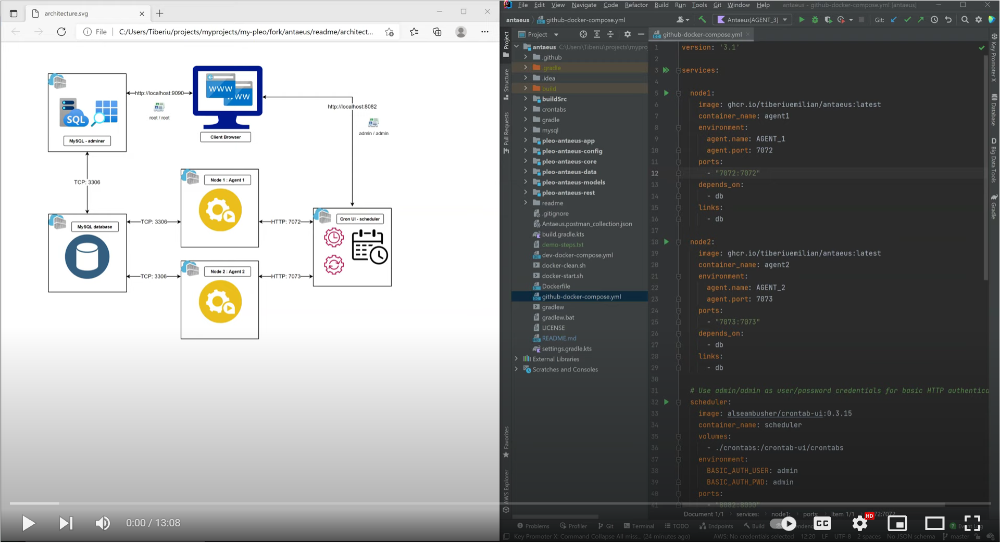

## Antaeus

Antaeus (/ænˈtiːəs/), in Greek mythology, a giant of Libya, the son of the sea god Poseidon and the Earth goddess Gaia. He compelled all strangers who were passing through the country to wrestle with him. Whenever Antaeus touched the Earth (his mother), his strength was renewed, so that even if thrown to the ground, he was invincible. Heracles, in combat with him, discovered the source of his strength and, lifting him up from Earth, crushed him to death.

Welcome to our challenge.

## The challenge

As most "Software as a Service" (SaaS) companies, Pleo needs to charge a subscription fee every month. Our database contains a few invoices for the different markets in which we operate. Your task is to build the logic that will schedule payment of those invoices on the first of the month. While this may seem simple, there is space for some decisions to be taken and you will be expected to justify them.

## Wiki content:
- ###[Challenge details](/readme/original-readme.md)
- ###[Choose the right hammer](/readme/the-right-hammer.md)
- ###[Solution architecture](/readme/architecture.md)
- ###[Tests](/readme/tests.md)
- ###[CI with GitHub Actions & GitHub containers registry](/readme/ci-github.md)
- ###[Performance considerations](/readme/performance-considerations.md)
- ###[Database backup & restore](/readme/db-dump.md)
- ###[Cron UI - initial configuration](/readme/cron-ui-config.md)
